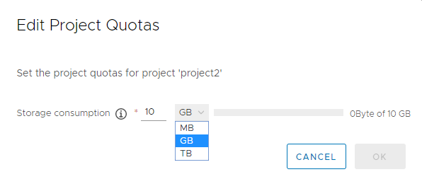

To exercise control over resource usage, as a Harbor system administrator you can set quotas on projects to limit the amount of storage capacity that a project can consume. 

You can set default quotas that apply to all projects globally.


Default quotas apply to projects that are created after you set or change the default quota. The default quota is not applied to projects that already existed before you set it.


You can also set quotas on individual projects. If you set a global default quota and you set different quotas on individual projects, the per-project quotas are applied.

By default, all projects have unlimited quotas for storage use. 

1. Select the **Project Quotas** view.

    
1. To set global default quotas on all projects, click the **Edit** link.

    

    - For **Default storage consumption**, enter the maximum quantity of storage that a project can consume.
      Specify the number and select the unit (`MB`, `GB`, or `TB`) from the drop-down menu, and then click **OK**. To set the default to unlimited, enter `-1`.  
    

1. To set quotas on an individual project, select the project and then click the **Edit** button.
    
    - For **Storage consumption**, enter the maximum quantity of storage that this individual project can consume.
      Specify the number and select the unit (`MB`, `GB`, or `TB`) from the drop-down menu, and then click **OK**. To set the default to unlimited, enter `-1`.  

After you set quotas, you can see how much of their quotas each project has consumed.

### How Harbor Calculates Resource Usage

When setting project quotas, it is useful to know how Harbor calculates storage use, especially in relation to image pushing, retagging, and garbage collection.

- Harbor computes image size when blobs and manifests are pushed from the Docker client.

  
  When users push an image, the manifest is pushed last, after all of the associated blobs have been pushed successfully to the registry. If several images are pushed concurrently and if there is an insufficient number of tags left in the quota for all of them, images are accepted in the order that their manifests arrive. Consequently, an attempt to push an image might not be immediately rejected for exceeding the quota. This is because there was availability in the tag quota when the push was initiated, but by the time the manifest arrived the quota had been exhausted.
  
- Shared blobs are computed only once per project. In Docker, blob sharing is defined globally. In Harbor, blob sharing is defined at the project level. As a consequence, overall storage usage can be greater than the actual disk capacity.
- Retagging images reserves and releases resources: 
  -  If you retag an image within a project,  the storage usage does not change because there are no new blobs or manifests.
  - If you retag an image from one project to another, the storage usage increases.
- During garbage collection, Harbor frees the storage used by untagged blobs in the project.
- Helm chart size is not calculated.
